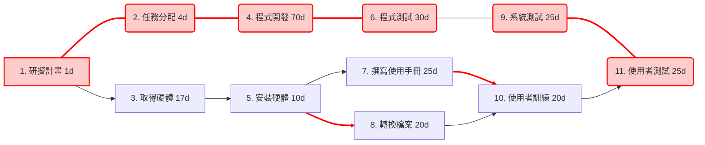

## (1）PERT/CPM圖

---
## (2) 甘特圖
```mermaid
gantt
    title 專案甘特圖 (以日數計算，總工期 155 天)
    dateFormat  x
    axisFormat  %s

    section 關鍵路徑
    1. 研擬計畫      :crit, id1, 0, 1d
    2. 任務分配      :crit, id2, 1, 4d
    4. 程式開發      :crit, id4, 5, 70d
    6. 程式測試      :crit, id6, 75, 30d
    9. 系統測試      :crit, id9, 105, 25d
    11. 使用者測試  :crit, id11, 130, 25d

    section 其他任務
    3. 取得硬體      :id3, 1, 17d
    5. 安裝硬體      :id5, 18, 10d
    7. 撰寫使用手冊 :id7, 28, 25d
    8. 轉換檔案      :id8, 28, 20d
    10. 使用者訓練  :id10, 53, 20d
