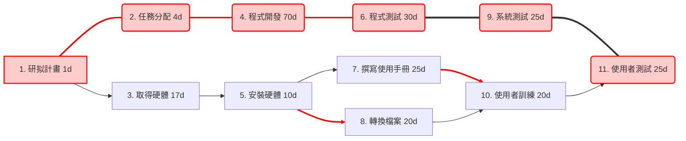

## (1）PERT/CPM圖

---
## (2) 甘特圖
```mermaid
gantt
    title 專案甘特圖
    dateFormat  YYYY-MM-DD
    section 計畫
    研擬計畫          :a1, 2025-09-01, 1d
    任務分配          :a2, after a1, 4d
    section 硬體
    取得硬體          :a3, after a1, 17d
    安裝硬體          :a5, after a3, 10d
    撰寫使用手冊      :a7, after a5, 25d
    轉換檔案          :a8, after a5, 20d
    section 軟體
    程式開發          :a4, after a2, 70d
    程式測試          :a6, after a4, 30d
    系統測試          :a9, after a6, 25d
    section 使用者
    使用者訓練        :a10, after a7 a8, 20d
    使用者測試        :a11, after a9 a10, 25d
